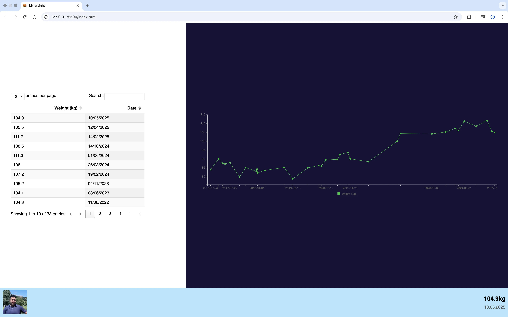

<p align="center">
  
</p>

---

# 📊 My Weight

Ce projet est une application web simple développée en **HTML**, **CSS** et **JavaScript** pour suivre l'évolution de mon poids corporel depuis **2016 jusqu'à aujourd'hui**.  
Elle utilise **[Billboard.js](https://naver.github.io/billboard.js/)** pour la visualisation graphique et **[DataTables](https://datatables.net/)** pour le tri, la recherche et la pagination des données tabulaires.

---

## 🚀 Fonctionnalités

- 📅 Suivi du poids mois par mois depuis 2016
- 📈 Visualisation interactive des données avec Billboard.js
- 📋 Tableau de données filtrable, triable et paginé avec DataTables
- 📱 Interface responsive pour mobile, tablette et desktop

---

## 🛠️ Technologies utilisées

- **HTML5**
- **CSS3** (avec un peu de responsive design)
- **JavaScript Vanilla**
- **[Billboard.js](https://naver.github.io/billboard.js/)** – Graphiques dynamiques (courbes, barres…)
- **[DataTables](https://datatables.net/)** – Tableaux interactifs

---

## 📁 Structure du projet

```
/assets
  /images
  /lib
  /scripts
    main.js              ← Script JS principal
  /styles
    style.css            ← Feuille de style
/index.html               ← Page principale
```

---

## 🔧 Installation

1. Clone le dépôt :

```bash
git clone https://github.com/ElmahdiK/myweight
cd myweight
```

2. Ouvre `index.html` dans ton navigateur :
   - En double-cliquant
   - Ou via une extension type **Live Server** sur VS Code

---

## 📫 Contact

Pour toute question, suggestion ou autre, vous pouvez me contacter via les moyens suivants :

- **Email**: [elmahdi.korfed@gmail.com](mailto:elmahdi.korfed@gmail.com)
- **LinkedIn**: [https://www.linkedin.com/in/elmahdikorfed/](https://www.linkedin.com/in/elmahdikorfed/)

---

## 📝 Licence

Projet open source sous licence [MIT](LICENSE) – libre de l'utiliser et de le modifier.